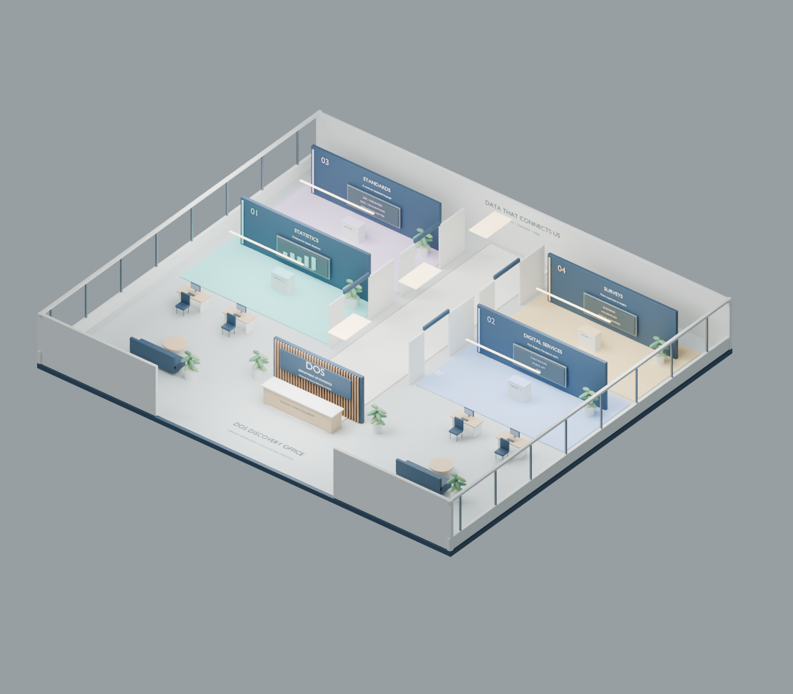

# DOS Discovery Office

**Hosted browser walkthrough:** https://dos-discovery-office.daniel-tianwen.chatgpt.site

Published publicly on ChatGPT Sites on 20 September 2026; no sign-in is required. The browser version uses the Blender geometry in WebGL, with a customisable third-person avatar, random avatar selection, mobile zoom and walking controls, four gallery activities, sourced SingStat wall displays and a floor-plan overview. Gallery officers link to SANDRA and DOS email. It is separate from the Unreal executable workflow below. Web source is in `web/`; Sites project identity is in `web/.openai/hosting.json`.

A conceptual 28 x 24 metre Department of Statistics visitor floor, modelled in Blender, with a UE5 C++ walkthrough project and automated FBX import. The four galleries cover statistics, digital services, statistical standards and surveys.

**Delivery status:** the `.blend`, FBX and four preview renders have been generated in Blender 5.2.1. The Unreal source project is provided, but Unreal Editor is unavailable on this machine: no compiled game, `.umap` or `.uasset` is claimed as delivered. The import script creates the Unreal assets on a machine with UE and its C++ toolchain.



## Open the model

Open `assets/DOS_Discovery_Office.blend` in Blender. The master retains editable objects, materials, labels, cameras and lights. Use the `Overview`, `Visitor view`, `Gallery view` and `Floor plan` cameras. The cutaway is intentionally open at the ceiling for review.

Preview images: [reception](renders/reception.png), [statistics gallery](renders/statistics-gallery.png), [floor plan](renders/floor-plan.png).

## Build and import into Unreal

The source targets UE 5.6 APIs. This is a compatibility target, not a claim that 5.6 is the latest release. An existing Unreal installation and a compatible Windows C++ compiler / Windows SDK are required. No downloads, administrator privileges or execution-policy changes are performed by the scripts. On a managed device, use the approved development environment; the import script can also be selected from the editor UI if PowerShell scripts are restricted.

**Windows PowerShell**, from this folder, after setting the path to your installed engine:

```powershell
.\scripts\build_unreal.ps1 -EngineRoot 'C:\Program Files\Epic Games\UE_5.6' -OpenEditor
```

1. Build the editor target with the command above (or generate Visual Studio project files and build `DOSExplorerEditor`, Development Editor / Win64).
2. The command opens the engine's empty Entry map on the first run. Save any other work before importing.
3. In Unreal, choose **Tools > Execute Python Script**, then select `Unreal/DOSExplorer/Content/Python/import_office.py`.
4. The script imports `assets/DOS_Office.fbx`, normalizes sockets, checks dimensions and collision, creates `/Game/DOS/Maps/DOS_Office`, adds lighting and arrival point, and assigns the DOS game mode.
5. Press **Play**, then click the viewport. Walk around reception to reach the central corridor, or press **G** to visit the first gallery.
6. Check `Saved/dos_import_report.json` and complete [the Unreal acceptance checks](docs/UNREAL_ACCEPTANCE.md) before packaging for visitors.

The importer replaces only its generated actors inside the DOS map and reimports assets under `/Game/DOS`. Keep custom scene work elsewhere. The full delivered folder structure must remain intact for the importer to find the FBX.

## Visitor controls

| Key | Action |
|---|---|
| WASD or arrow keys | Walk |
| Mouse | Look |
| E | Read nearby exhibit / close exhibit |
| 1 / 2 | Answer the current learning activity |
| G | Move to the next gallery |
| H | Return to reception |
| Q | Close the exhibit |
| F | Open the exhibit's official resource in the external browser |

The runtime code supplies collision-based first-person movement, proximity prompts, guided station travel, four offline content panels, short activities with answer feedback, and session-only exploration progress. It uses native C++ for runtime behavior; Python is used only in the editor to import assets.

Learning content is bundled locally in `Unreal/DOSExplorer/Content/Data/exhibits.json` and staged with packaged builds. Walking and reading are designed to work offline. Opening an official website requires permitted internet access. There is no live chatbot integration, telemetry, login or real survey submission. Progress resets when a new play session starts.

## Rebuild the Blender assets

**Windows PowerShell** using the Blender installation verified on the build machine:

```powershell
& 'C:\Program Files\Blender Foundation\Blender 5.2\blender.exe' --background --python scripts\build_office.py
python scripts\validate_project.py
& 'C:\Program Files\Blender Foundation\Blender 5.2\blender.exe' --background --python scripts\verify_fbx.py
```

The generator rewrites its generated model, export, manifest and renders. Adjust `scripts/build_office.py` to change the room and furniture geometry. Edit `exhibits.json` for educational copy and quiz answers; rebuild the model when changing the gallery positions or signage.

## Design and content

The visitor journey is reception -> Statistics -> Digital Services -> Standards -> Surveys -> reception. The floor includes seating, planted areas and four sample workstations to convey an office setting. It is a conceptual learning floor, not a measured DOS office, official branding package, fire plan or accessibility certification.

Content follows the categories visible in [Ask SingStat](https://chat.vica.gov.sg/dos-ask-singstat?vica-session-handoff) and linked official DOS resources. The original Blender bar graphics are illustrative and explicitly labelled. The hosted browser version adds framed, dated SingStat statistics and source links; these are historical snapshots, not live data. See [source notes](docs/SOURCES.md).

The editable Blender model is modular. Its Unreal export is combined into one mesh with separate custom collision hulls and named sockets, keeping the first import simple. The tradeoff is coarse culling and a single large mesh; split rooms and optimize lighting/materials after measuring on the intended visitor hardware.

The hosted browser version is public as of 20 September 2026. Version 4 adds Man/Woman style menus, random avatar creation and four sourced SingStat wall displays. These updates apply to the browser scene; the original Blender/Unreal download is unchanged.

## Web development

From a GitHub clone, run these commands in **Windows PowerShell**, using an existing approved Node.js/npm installation:

```powershell
Set-Location web
npm ci
npm run dev
```

Use `npm run build` to produce the static web app in `web/dist`. See [the web README](web/README.md) for controls and contact configuration. The `.openai/hosting.json` in `web` identifies the existing ChatGPT Sites project; it does not grant deployment access. This GitHub repository contains the complete project. The original development workspace also keeps a separate Sites source checkout in `web`.
